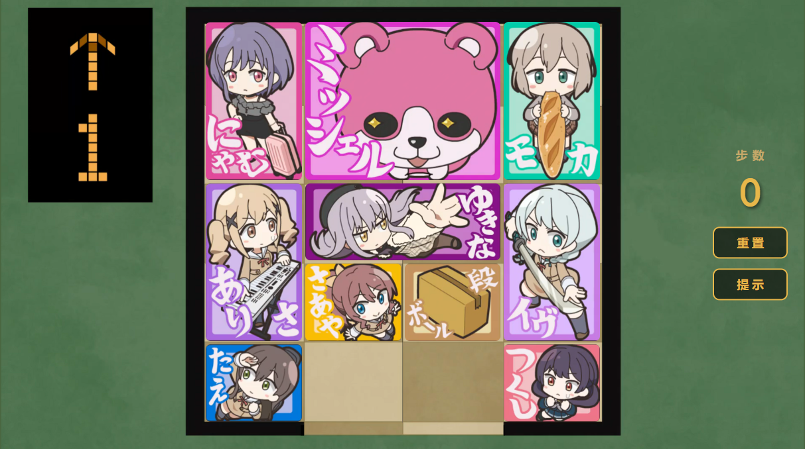

# 🎀 BanG Dream! 华容道

一个以 **BanG Dream!** 为主题的网页华容道（Klotski）益智小游戏。帮助米歇尔（Michelle）从重重包围中逃出，到达底部出口即为通关！

## 🎮 游戏特性

- **经典华容道玩法** — 4×5 棋盘，10 个角色方块，拖拽移动
- **智能提示** — 内置 BFS 最短路径求解器，点击"提示"自动执行最优下一步
- **纯前端单文件** — 零依赖，[**点击**](https://fflow2023.github.io/BanGKlotski) 即可游玩
- **移动端适配** — 支持触摸拖拽操作

## 💡 灵感来源

本项目灵感来源于动画 [《BanG Dream!》元祖第 19 集](https://www.bilibili.com/bangumi/play/ep3129294)，剧中出现了华容道的小游戏，于是萌生了复刻这个小游戏的想法。    

## 🤖 关于开发

本项目的主要生产工具是 **Antigravity** 和 **Claude Opus 4.6 (Thinking)**。

几乎全部代码内容均由 AI Agent 完成——从需求分析（Plan）、编码实现（Coding）到测试验证（Test）和问题修复（Debug），全程由 Agent 独立驱动，我主要负责提出需求与裁剪素材。

作为一个学计算机的学生，亲眼见证现在的 AI 仅凭一段提示词就能独立完成一个完整项目的全流程开发，实在是不可思议。不过我对于未来的前景还是比较乐观的，与其整天担心被 AI 替代，不如先学会如何驾驭 AI 工具。

## ⚖️ 版权声明

- 游戏中使用的角色设定、图像、音频及相关素材版权归 **BUSHIROAD** 旗下 **BanG Dream! 企划** 所有。
- 本项目为非盈利粉丝向同人作品，仅供邦邦粉丝之间学习交流使用。如有侵权请联系删除。